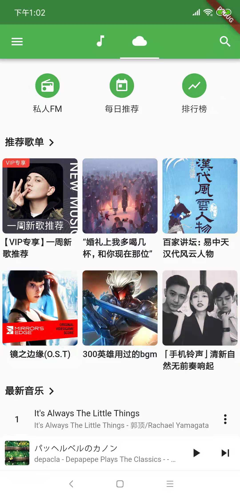
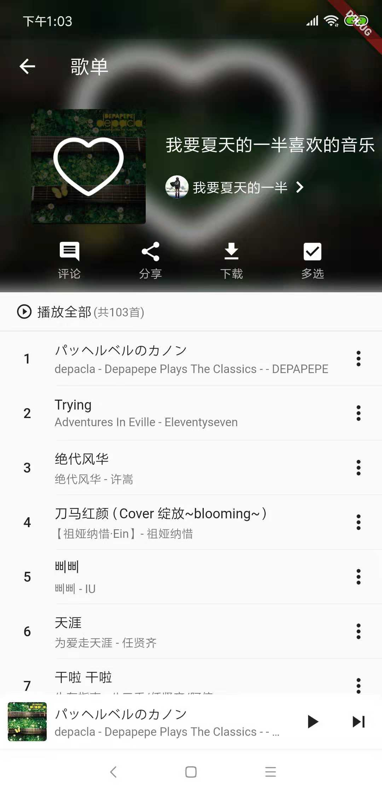
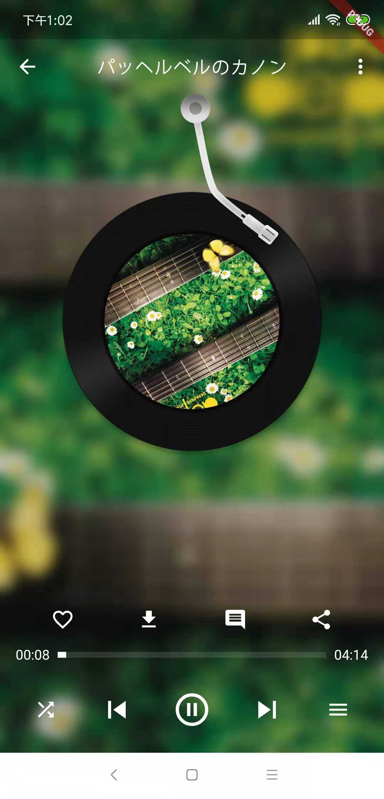

# Quiet

仿网易云音乐，一边学习一边开发。希望能多点**star**，给予动力完成此项目。
netease music player. working in progress！

all API information comes from this project: [NeteaseCloudMusicApi](https://github.com/Binaryify/NeteaseCloudMusicApi) 

**因无iOS设备，故平台化代码只写Android部分，欢迎PR**
**For personal reasons(have not iOS devices), the platformized code will only write the Android part**

# How to start

 * install [Flutter](https://flutter.io/docs/get-started/install)
 * run in Command Line
 ```
 flutter run --profile
 ```

# interaction

|  | todo |
| :-------------------------------------------------: | :--: |
|                                                     |      |


# Preview

|     |                |  |  |
| :------------------------------------------------: | :----------------------------------------------------: | :------------------------------------------------: | :--------------------------------------------: |
|      |                      |                    |  |
|  |  |        |                                                |


